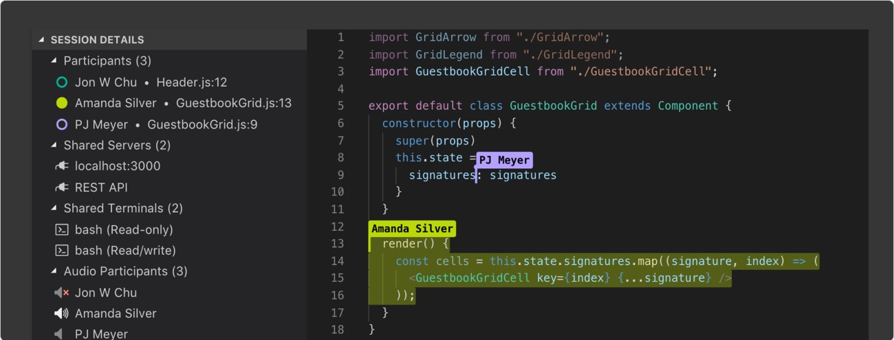



<h1>Collaboration Server Protocol</h1>

The Collaboration Server Protocol (CSP) specifies the protocol used between an
editor or IDE and a server that offers collaboration features such as
interactive chat bubbles, parallel editing, and more. Unlike the
<a href="https://microsoft.github.io/language-server-protocol/">Language Server Protocol (LSP)</a>
, there is no need to implement the collaboration server based on the specific
features of each programming language. Instead, you implement the client to
interact with the pre-existing server,
<a href="https://github.com/Cogru/cogru">Cogru</a>.

<a class="github-button" href="https://github.com/Cogru/collaboration-server-protocol/subscription" data-color-scheme="no-preference: light; light: light; dark: dark;" data-icon="octicon-eye" data-size="large" data-show-count="true" aria-label="Watch Cogru/collaboration-server-protocol on GitHub">Watch</a>
<a class="github-button" href="https://github.com/Cogru/collaboration-server-protocol/fork" data-color-scheme="no-preference: light; light: light; dark: dark;" data-icon="octicon-repo-forked" data-size="large" data-show-count="true" aria-label="Fork Cogru/collaboration-server-protocol on GitHub">Fork</a>
<a class="github-button" href="https://github.com/Cogru/collaboration-server-protocol" data-color-scheme="no-preference: light; light: light; dark: dark;" data-icon="octicon-star" data-size="large" data-show-count="true" aria-label="Star Cogru/collaboration-server-protocol on GitHub">Star</a>

<a class="btn btn-lg  me-3" href="docs/get-started/">Get started <i class="fas fa-arrow-alt-circle-right ml-2"></i></a>
<a class="btn btn-lg" href="#">Contribute <i class="fas fa-pencil-alt ml-2"></i></a>

<!--   -->

<!-- {} -->



<!-- Middle -->

{}

<h2>What is the Collaboration Server Protocol?</h2>

Porttitor rhoncus dolor purus non enim praesent elementum facilisis leo. Vel facilisis volutpat, est velit egestas dui, id ornare arcu odio ut sem nulla pharetra diam sit amet nisl suscipit.

  

    
  

  

    
  

  

    
  

{}

<!-- Last -->

{}

{}
<h3 class="mb-3 "><a href="overview/">Overview</a></h2>

WIP.

{}

{}
<h3 class="mb-3"><a href="docs/">Specification</a></h2>

WIP.

{}

{}
<h3 class="mb-3"><a href="blog/">Implementations</a></h2>

WIP.

{}

{}

<!-- Links -->

